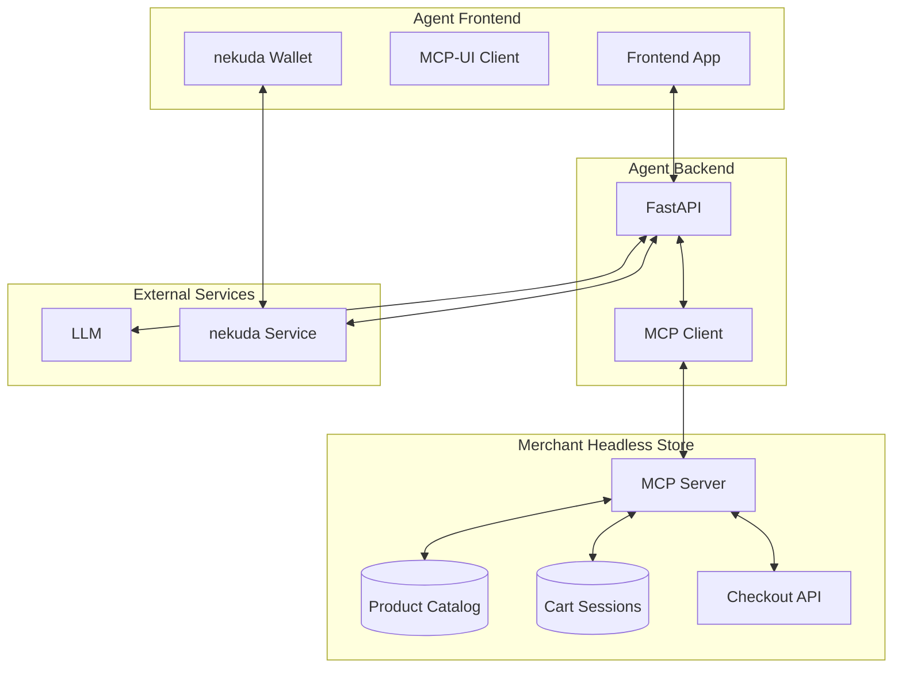
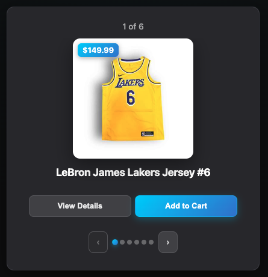

# MCP-UI Demo with nekuda Unified Wallet

  
  
  Next-gen agentic commerce demo: AI agents + unified payments

## Key Features

  1. **Headless stores** - AI apps communicate directly with headless stores via MCP and APIs
  2. **Interactive UI components** - Components render using the MCP-UI standard
  3. **One-click payments** - Single [nekuda wallet](https://nekuda.ai) works across all merchants through direct payment credential transfer (will work with [Visa Intelligent Commerce](https://corporate.visa.com/en/products/intelligent-commerce.html))

  You can interact with a live demo [here](https://nekuda-frontend.onrender.com/). 

  ## Quick Start

### Prerequisites
- Node.js 18+ and npm 8+
- Python 3.8+ 
- OpenAI API key

### Setup

1. **Clone and install dependencies**
```bash
git clone <repository-url>
cd nekuda-mcp-ui-demo
npm run install:all
```

2. **Configure environment variables**
```bash
# Copy the environment template
cp .env.example .env

# Edit .env and add your keys (see Environment Variables section below)
```

3. **Start the application**

**Option A: Using start.sh (Recommended)**
```bash
./start.sh
```

**Option B: Using npm**
```bash
npm run dev
```

4. **Access the demo**
- Frontend: http://localhost:5173
- Backend API: http://localhost:8001
- MCP Server: http://localhost:3003

### Architecture Services
- **Frontend**: http://localhost:5173 (Vue + MCP-UI)
- **Backend API**: http://localhost:8001 (FastAPI + OpenAI)  
- **MCP Server**: http://localhost:3003 (E-commerce tools)

## Environment Variables

This application requires several environment variables to function properly. Copy `.env.example` to `.env` and configure the following:

### Required Variables

| Variable | Description | Required For | Example |
|----------|-------------|--------------|---------|
| `OPENAI_API_KEY` | OpenAI API key for LLM functionality | Backend API | `sk-proj-abcd1234...` |
| `NEKUDA_API_KEY` | nekuda private API key for payment processing | Backend API | `sk_1eoq8RmA3VN...` |
| `VITE_NEKUDA_PUBLIC_KEY` | nekuda public key for wallet widget | Frontend | `ak_public_key...` |

### Optional Variables

| Variable | Description | Default | Options |
|----------|-------------|---------|---------|
| `ENVIRONMENT` | Application environment | `development` | `development`, `production` |

### Getting nekuda API Keys

   - Contact [founders@nekuda.ai](mailto:founders@nekuda.ai) for access


## Components

**Frontend** (`frontend/`)  
Vue 3 + TypeScript application providing the chat interface and MCP-UI client integration.

**Backend API** (`backend/`)  
FastAPI service that orchestrates chat sessions, MCP communication, and payment flows.

**MCP Server** (`mcp-server/`)  
Simulated headless commerce store implementing MCP protocol with e-commerce tools and UI components.

## Architecture




## MCP-UI Implementation

The demo implements the emerging [MCP-UI](https://github.com/idosal/mcp-ui) standard that combines chat interfaces with interactive web components.

### Chat + Interactive Components

Traditional e-commerce agents return only text. MCP-UI enables rich interactions:

```typescript
// User: "show me all products"
// Instead of text response, agent calls get_products() tool
// Returns interactive product carousel component
```

<div align="center">
  
</div>

### Tool Architecture

**MCP Tools**
- `get_products` - Product catalog with interactive UI carousel
- `get_cart_state` - Cart state snapshot (structured data, no UI)  
- `add_to_cart` - Add items with confirmation UI
- `checkout` - Checkout flow with nekuda payment integration


### Function Calling Flow

```python
# OpenAI determines tool usage from user intent
tools = await get_mcp_tools()  # Fetch available MCP tools
response = await openai_client.chat.completions.create(
    model="gpt-3.5-turbo",
    messages=conversation,
    tools=tools,  # MCP tools as OpenAI functions
    tool_choice="auto"
)

# Execute MCP tool and render UI component
mcp_response = await call_mcp_tool(tool_name, params)
ui_component = extract_ui_resource(mcp_response)
```

## Unified Checkout Architecture

This demo shows a unified payment architecture. Today, commerce MCPs provide catalog, cart, and checkout (e.g. PayPal, Shopify), but each is tied to a different vendor. When embedded, agents face fragmented checkout flows: multiple UIs and inconsistent experiences, which can create user fatigue. More importantly, these flows all require a human in the loop, which makes true agentic payments impossible. Our solution centers on an agent-level wallet - one wallet that enables one-click checkout across merchants, plus enabling autonomous payments in the future.

### Agent-Level Wallet

- Single wallet works across all merchants
- Network tokens eliminate PAN/CVV reuse risk
- Dynamic CVV (DTVV) generated per transaction
- True one-click checkout across ecosystems

### Payment Flow

When a user clicks "Place Order," the system executes a single atomic payment operation:

1. **Payment Authorization** - Creates a mandate capturing the user's explicit approval for this specific purchase and amount, stored securely with nekuda service.

2. **Credential Generation** - Retrieves a short-lived payment token, then exchanges it for payment credentials (network token or PAN).

3. **Merchant Settlement** - Returns the payment credentials along with the cart session ID to the backend for merchant processing.

```typescript
// Atomic payment operation triggered by "Place Order" click
const mandate_id = await nekuda_service.create_mandate_for_checkout({
  user_id, cart_total, cart_items, checkout_context
})

const payment_credentials = await nekuda_service.get_payment_credentials(
  user_id, mandate_id  
)

// Credentials returned to backend with cart session for processing
return { payment_credentials, cart_session_id }
```

This atomic approach eliminates checkout friction and works with any merchant's headless commerce system.


## Contact

For access to the nekuda wallet or any questions about the unified payment architecture, please reach out to [founders@nekuda.ai](mailto:founders@nekuda.ai).
